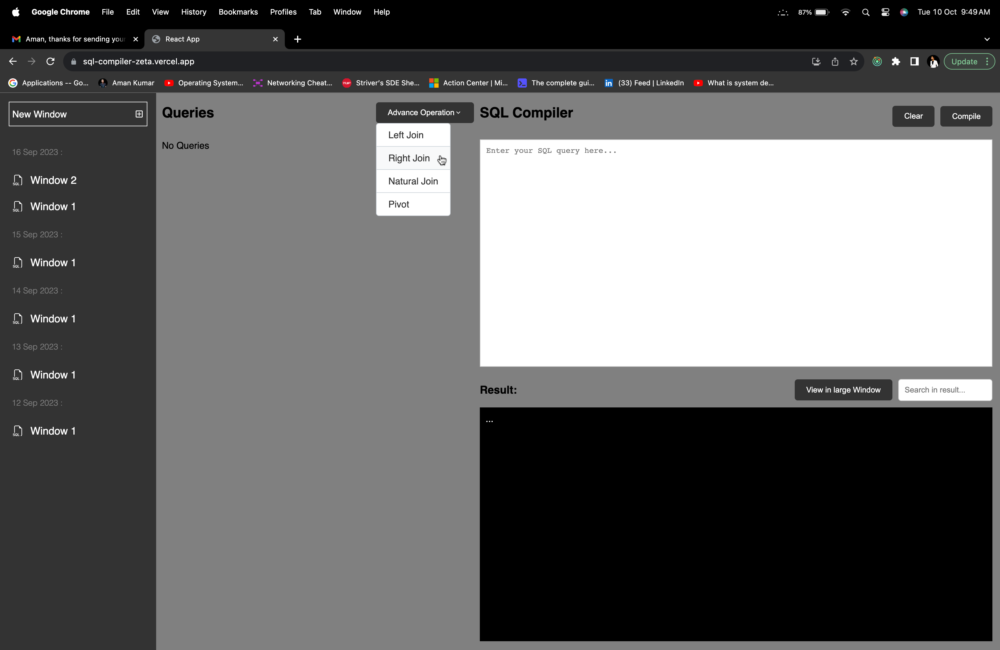
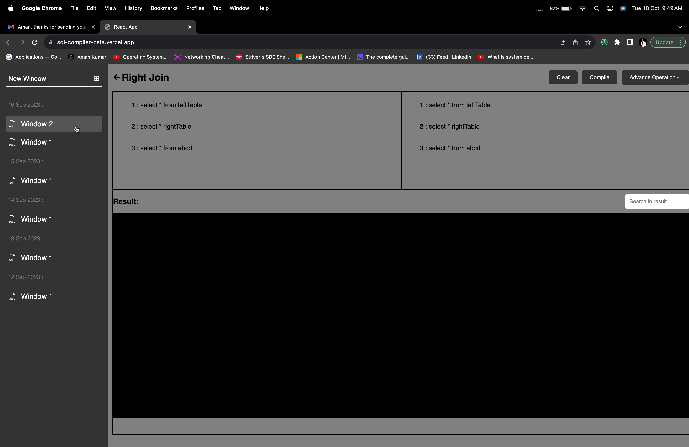
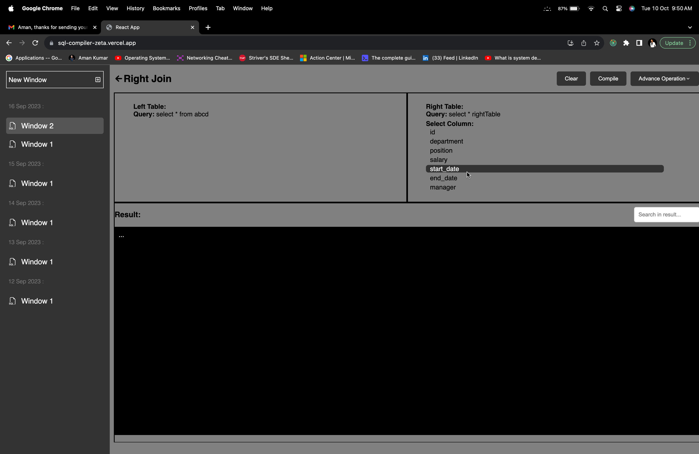
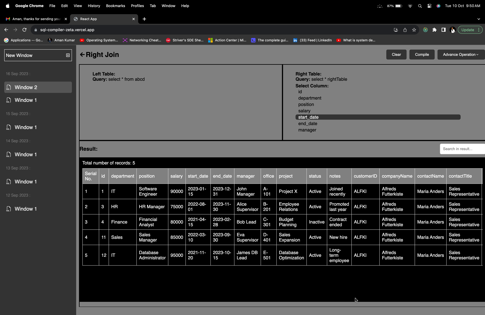
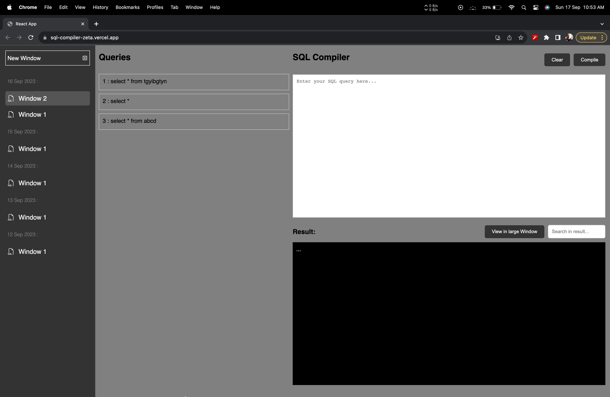
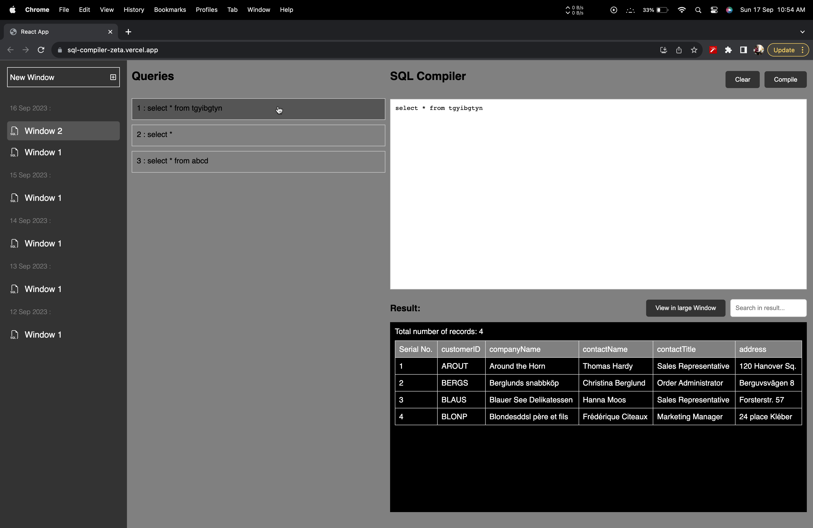
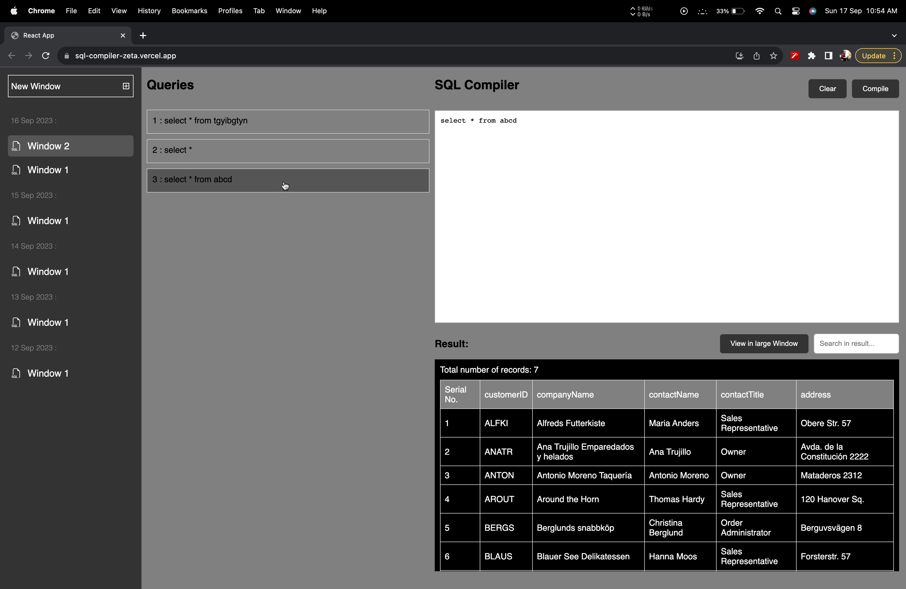
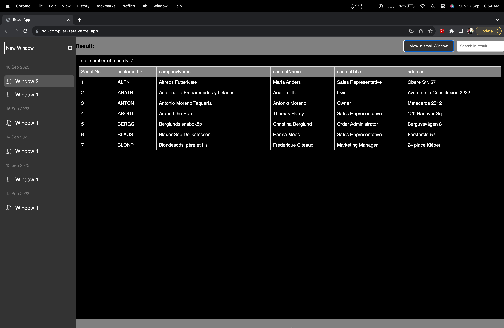
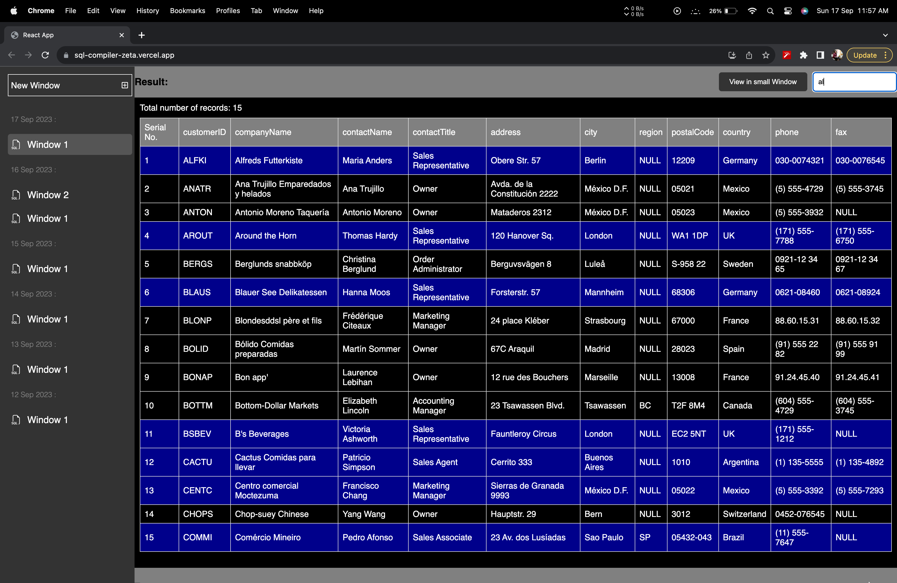
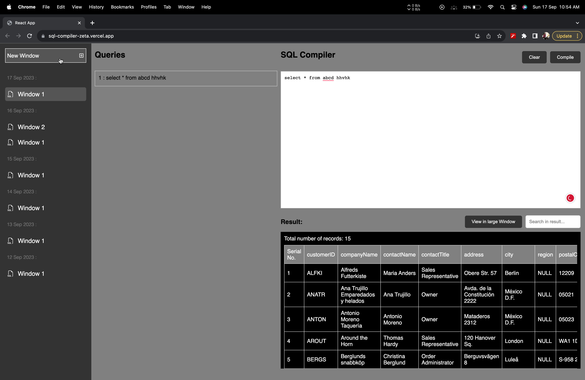

# sql-compiler

- sql-compiler is a dummy application capable of running SQL queries and displaying the results of said query (The data and the query do not need to be in sync).
- The data that the application displays is a chunk of data. It is not the actual result that the query would display if it was actually run.
- The app is not responsive in portrait mode and is suggested to view in landscape mode/ on a desktop.
- Techs Involved - ReactJS | Redux | Git | HTML
- React Library include: reduxjs/toolkit | react-redux | react-icons | styled-components
- The total time taken to load the application is 300ms and it is measured by the Browser Developer Tools of Chrome (The network tab displays the time it takes to load each resource like HTML, CSS, JavaScript, images, etc., and the overall page load time).
- I have used code splitting to optimize the load time of the application.

### Detailed Design

- Built the app using react functional components with hooks to handle state and other life cycle methods
- Kept the layout of the application simple to have any modification or enhancement in the future to evolve the layout as required
- The application has only one screen i.e. Dashboard

### Changes in version 2.0

- Added a advanced functionality on the tables like: joins and pivot.
- In the recent window top-right has a advanced operation dropdown, where you can select the operation you want to perform.
- I have added a dropdown on recent window that shows some advance operations on tables like joins and pivot.
- In joins operation we have to select the left table and right table, we can do it by selecting the desired window and select the table from there.
  
  
  
  
  
- ### Dashboard
  
- This is the dashboard which contains three main components i.e. Sidebar, Queries, and Compiler.
- Sidebar contains the day-wise windows (windows are something where a user can execute separate queries on the same day).
- Queries contain all the queries executed in the selected window.
- Compiler mainly contains two parts: 1) Input textarea and 2) Result output

- The user can only execute the query in the windows of today's date.
- The user can select the query from the Queries to view the corresponding table of data.
- The queries executed by the user are stored in a redux store hence after reloading the page it will erase all the recent queries except those that are stored in a separate file.

- User can view the result/output table in large size view by clicking on the button "View in large Window".

- Output result has the functionality of searching in the output table.

- Users can create multiple windows in today's session and execute queries in separate windows.

## How to Run the Application:

Clone the repo and set up the application

- git clone [https://github.com/amankumar-2001/sql-compiler](https://github.com/amankumar-2001/sql-compiler.git)
- cd sql-compiler
- npm install
- npm start

## Application Link

- Application link deployed on Vercel: [https://client-dic.vercel.app/users/login](https://sql-compiler-zeta.vercel.app/)

## Author

- [@amankumar-2001](https://www.github.com/amankumar-2001)
