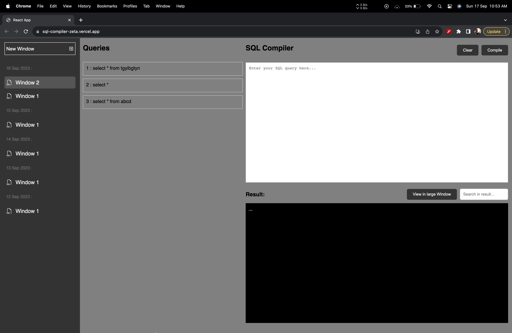

# sql-compiler

- sql-compiler is a dummy application capable of running SQL queries and displaying the results of said query (The data and the query do not need to be in sync).
- The data that the application displays is a chunk of data. It is not the actual result that the query would display if it was actually run.
- The app is not responsive in portrait mode and is suggested to view in landscape mode/ on a desktop.
- Techs Involved - ReactJS | Redux | Git | HTML
- React Library include:  reduxjs/toolkit | react-redux | react-icons | styled-components

### Detailed Desi

- Built the app using react functional components with hooks to handle state and other life cycle methods
- Kept the layout of the application simple to have any modification or enhancement in the future to evolve the layout as required
- The application has only one screen i.e. Dashboard
- ### Dashboard
This is the home page i.e. first page.

### Dashboard

- This is the dashboard.

### Detail data

- Every element's detailed information.

### Create Modal

- This is create modal.

## How to Run the Application:

Clone the repo and set up the application

- git clone [https://github.com/amankumar-2001/deep-into-crud](https://github.com/amankumar-2001/client-DIC.git)
- cd client-DIC
- npm install
- npm start

## Application Link

- Application link deployed on Vercel: https://client-dic.vercel.app/users/login
## Author

- [@amankumar-2001](https://www.github.com/amankumar-2001)

